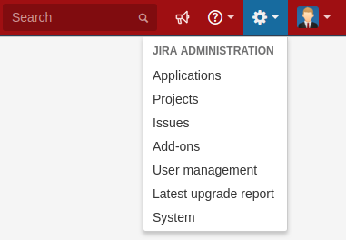
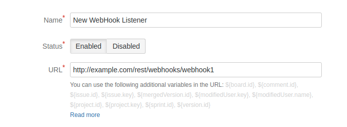
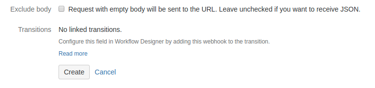

# jira-webhook

Use this JIRA webhook to create a simple bot. Simply add one of the following commands to your issue description and let the bot do the rest.

## Commands

### @bot subtract

- take story points from new issue
- subtract story points from epic
- add comment to newly created issue

## JIRA configuration

1. Administration -> System

    

1. Advanced -> WebHooks

    

1. Create a WebHook

    

1. Enter some name and set your URL. Make sure your JIRA server can access the computer where your JIRA webhook is running.

    

1. Leave the rest as is and click on Create

    

## Development

Activate Go modules.

```
export GO111MODULE=on
```

Build image.

```
docker build --tag=bot .
```

Run image. `dns` is required to find JIRA from inside the container. Remove it if your JIRA instance doesn't require custom DNS settings.

```
docker run -d -p 8060:8060 --dns 172.19.169.27 -e JIRA_USERNAME='john' -e JIRA_PASSWORD='wayne' bot
```